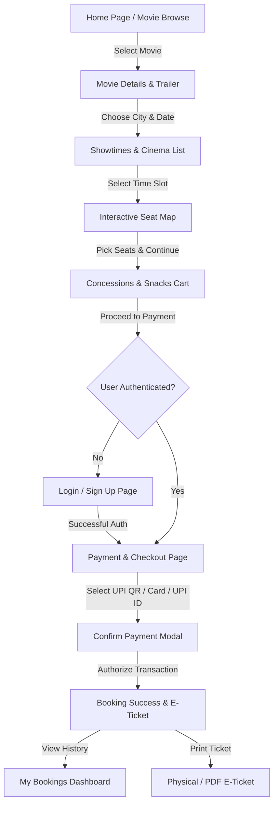

# 🎬 CineBook - Premium Cinema Ticket Booking Platform

[](https://github.com/)
[](https://angular.dev/)
[](https://www.typescriptlang.org/)
[](https://github.com/)
[](LICENSE)

An enterprise-grade, dark luxury **Single Page Application (SPA)** for online movie discovery, seat reservation, food & beverage ordering, multi-channel payment gateway, and digital e-ticket generation.

---

## 📋 Table of Contents
1. [Project Overview](#-project-overview)
2. [Key Features & Highlights](#-key-features--highlights)
3. [End-to-End User Booking Workflow](#-end-to-end-user-booking-workflow)
4. [Authentication & Payment Return Architecture](#-authentication--payment-return-architecture)
5. [Multi-Channel Payment Gateway](#-multi-channel-payment-gateway)
6. [Technology Stack & Architectural Design](#-technology-stack--architectural-design)
7. [Repository File Structure](#-repository-file-structure)
8. [Quick Start (1-Click Launcher)](#-quick-start-1-click-launcher)
9. [Manual Setup & Development](#-manual-setup--development)
10. [Movie Catalog & Data Assets](#-movie-catalog--data-assets)
11. [Testing & Verification](#-testing--verification)
12. [Troubleshooting & FAQ](#-troubleshooting--faq)

---

## 🌟 Project Overview

**CineBook** is a modern web application delivering a cinema booking experience modeled after top industry platforms (like BookMyShow and AMC Theatres). Built on **Angular 19 Standalone Components**, **RxJS reactive state streams**, and a custom **dark-themed glassmorphic design system**, CineBook eliminates booking friction and ensures a smooth customer experience across all screen resolutions.

---

## ✨ Key Features & Highlights

### 🎭 1. Cinematic Hero Billboard & Trailer Previews
- High-impact widescreen banner showcasing trending blockbusters (*Amaran*, *Leo*, *Dune: Part Two*, *Deadpool & Wolverine*, *The Greatest of All Time*, etc.).
- Embedded YouTube trailer previews with autoplay modal.
- Age ratings (U/A, A), duration counters, genre badges, and direct "Book Tickets" call to action.
- Auto-advancing billboard with manual navigation indicators.

### ⚡ 2. Express 3-Tier Quick-Booking Wizard
- Sticky interactive booking strip positioned directly beneath the hero billboard.
- Sequential selector: **Movie** ➔ **Cinema / Location** ➔ **Date & Showtime Slot**.
- Direct 1-click leap to seat map reservation.

### 🎬 3. High-Resolution Poster Gallery & Cinematic Stills Showcase
- 2:3 aspect ratio vertical movie cards with rating pills, language tags, and format badges (IMAX 3D, 4DX, Dolby Atmos, P[XL]).
- Curated landscape scene gallery highlighting action moments.
- Multi-faceted filter bar by Genre, Experience format, and Language (Tamil, English, Telugu, Hindi).

### 💺 4. Interactive Curved Seat Selection Screen
- Ambient illuminated curved screen simulation.
- Tiered category layouts: **VIP Recliner** (₹280), **Premium Zone** (₹220), and **Standard Classic** (₹150).
- Real-time seat occupancy statuses (Available, Selected, Occupied).
- Max 6 tickets limit per order with dynamic price calculation.

### 🍿 5. Concession Snack Bar & Beverages Cart
- Popcorn varieties (Caramel Glazed, Butter, Peri Peri Masala, Cheese Burst).
- Hot snacks (Crispy Samosa, Loaded Mexican Nachos, Grilled Veg Cheese Sandwich, Paneer Tikka Burger).
- Beverages (Coca-Cola, Filter Coffee, Masala Chai, Mint Lime Soda) and Value Combo packs.
- Real-time quantity steppers and persistent cart state.

### 🔐 6. Intelligent Auth & Payment Flow Redirection
- **Seamless Flow**: Navigating from Seat Selection / Food ➔ Checkout ➔ Sign In / Sign Up smoothly returns directly to the **Payment & Checkout** page with seats, food items, and showtime fully preserved.
- Existing users log in instantly with auto-populated profiles and saved bookings.
- New users register with validation, select preferred cities, and proceed directly to payment without losing cart context.
- In-page checkout login tab allows quick user identification without leaving the payment screen.

### 💳 7. Multi-Channel Indian Payment Gateway
- **Dynamic UPI QR Code**: Live 10-minute auto-refreshing SVG QR code compatible with Google Pay, PhonePe, Paytm, BHIM, and Cred.
- **UPI ID / VPA**: Quick-handle buttons (`@okhdfcbank`, `@okaxis`, `@ybl`, `@paytm`, `@ibl`).
- **Credit / Debit Cards**: Validated 16-digit card input with CVV and expiry masking.
- **Net Banking**: Direct bank selection for HDFC, SBI, ICICI, Axis, Kotak, Indian Bank.
- **Digital Wallets**: Paytm, PhonePe Wallet, and Amazon Pay.
- **Coupon / Promo Engine**: Instant discount validation (e.g., `CINEFIRST`, `WEEKEND50`).

### 🎟️ 8. Digital E-Ticket Confirmation & Booking History
- Instant generation of official booking ID (`CBK-YYYYMMDD-XXXXX`).
- Scannable digital gate QR barcode.
- One-click **Print / Download PDF Ticket** formatted with perforated ticket borders.
- Dedicated **My Bookings** dashboard with status tracking (Confirmed, Completed, Cancelled) and cancellation refund actions.

---

## 🔄 End-to-End User Booking Workflow



---

## 🔐 Authentication & Payment Return Architecture

When an unauthenticated user proceeds to payment:

```
1. User clicks "Proceed to Checkout" on /food
2. AuthGuard intercepts /checkout route:
   - Stores intended route in localStorage ('cinebook_redirect_url')
   - Navigates to /login with query parameter (?returnUrl=/checkout)
3. On Login Page:
   - Existing users sign in with email & password.
   - Or user clicks "Sign Up" -> navigates to /signup (?returnUrl=/checkout)
   - New user registers account with name, mobile, email, city, password.
4. Upon successful Login or Sign Up:
   - AuthService logs user in, sets user state, and updates city preferences.
   - System retrieves returnUrl / redirect / cinebook_redirect_url.
   - User is redirected directly to /checkout (Payment Page).
5. On Payment Page:
   - Showtime, cinema, selected seats, and food items remain intact from LocalStorage state.
   - User profile info is auto-filled for ticket delivery.
```

---

## 💳 Multi-Channel Payment Gateway

| Mode | Technology | Features |
|---|---|---|
| **Instant UPI QR** | Dynamic High-Density SVG | 10-Minute expiry countdown, multi-app support (GPay, PhonePe, Paytm, BHIM, Cred) |
| **UPI ID / VPA** | Virtual Payment Address | 1-Click handle autofill (`@okhdfcbank`, `@okaxis`, `@ybl`, `@paytm`, `@ibl`) |
| **Credit / Debit Cards** | PCI-DSS Styled Form | Card number grouping, expiry validation, CVV masking, 256-bit encryption badge |
| **Net Banking** | Bank Selector Grid | Major Indian institutions (HDFC, SBI, ICICI, Axis, Kotak, Indian Bank) |
| **Wallets** | Digital Wallet Selection | Paytm Wallet, PhonePe Wallet, Amazon Pay |
| **Promo Coupons** | Dynamic Offer Validator | Real-time discount calculations on ticket & snack subtotals |

---

## 🛠️ Technology Stack & Architectural Design

- **Framework**: [Angular 19](https://angular.dev/) (Standalone Components, modern signal & RxJS reactive patterns)
- **Language**: [TypeScript 5.7+](https://www.typescriptlang.org/)
- **State Management**: Reactive RxJS `BehaviorSubject` services with `localStorage` persistent caching.
- **Styling Architecture**: Vanilla CSS3 Custom Properties (CSS Variables), Flexbox, CSS Grid, Glassmorphism backdrop filters.
- **Color Palette**:
  - `Background`: Deep Obsidian (`#070a13`, `#0b0f19`)
  - `Panels`: Midnight Navy (`#0f172a`, `rgba(15, 23, 42, 0.8)`)
  - `Accent Primary`: Cinema Crimson (`#e50914`, `#ff2a4d`)
  - `Highlights`: Gold Star (`#f5a623`, `#ffd166`)
  - `Success`: Emerald Green (`#00c853`)
- **Typography**: Google Fonts (`Outfit`, `Inter`, `Roboto`)
- **Icons**: Google Material Icons

---

## 📁 Repository File Structure

```
movie ticket booking project/
├── README.md                          # Comprehensive Complete Project Documentation
├── start-cinebook.bat                 # 1-Click Automated Batch Launcher (Build & Launch)
└── cinebook/                          # Angular Project Workspace Root
    ├── angular.json                   # Angular Build & Project Configuration
    ├── package.json                   # Dependencies & Scripts
    ├── tsconfig.json                  # TypeScript Compiler Configuration
    └── src/
        ├── index.html                 # Main HTML Entry Shell & Font Imports
        ├── main.ts                    # Standalone App Bootstrap
        ├── styles.css                 # Global CSS Variables, Utilities & Theme Resets
        └── app/
            ├── app.component.ts       # Root Application Component
            ├── app.routes.ts          # Angular Route Definitions & Auth Guards
            ├── guards/
            │   └── auth.guard.ts      # Authentication Guard with returnUrl Redirection
            ├── models/
            │   ├── movie.model.ts     # Movie Interface & Type Definitions
            │   ├── cinema.model.ts    # Cinema & City Interfaces
            │   ├── showtime.model.ts  # Showtime Slots Interface
            │   ├── seat.model.ts      # Seat Map & Pricing Tier Types
            │   ├── food.model.ts      # Food Items & Concession Cart Types
            │   ├── offer.model.ts     # Promo Coupons & Discounts Types
            │   └── user.model.ts      # User Account & Preference Types
            ├── services/
            │   ├── auth.service.ts    # Authentication & User State Service
            │   ├── booking.service.ts # Seat Reservation & Booking Storage Service
            │   ├── movie.service.ts   # Movie Catalog & Details Service
            │   ├── cinema.service.ts  # Cinema Venues & City Service
            │   ├── showtime.service.ts# Showtime Scheduling & Filter Service
            │   ├── food.service.ts    # Food Menu & Concession Cart Service
            │   └── offer.service.ts   # Promo Code Validation Service
            ├── components/
            │   ├── navbar/            # Header Navigation & City Selector
            │   ├── footer/            # Footer Links, Brand & Socials
            │   ├── movie-card/        # 2:3 Vertical Movie Card Component
            │   ├── modal/             # Reusable Backdrop Modal Dialog
            │   └── ...                # Search Overlay, Language & Date Pickers
            └── pages/
                ├── home/              # Hero Carousel, Quick-Book & Movie Grids
                ├── movie-details/     # Synopsis, Cast, Trailers & Showtimes
                ├── showtimes/         # City-wide Theatres & Time Slots
                ├── seat-selection/    # Curved Theater Screen & Seat Map
                ├── food/              # Concessions Food & Beverage Ordering
                ├── checkout/          # Multi-Channel Payment & User Details
                ├── login/             # User Login with returnUrl Handling
                ├── signup/            # User Registration with City Selector
                ├── booking-success/   # Digital E-Ticket & Print Window
                ├── my-bookings/       # Order History & Ticket Management
                ├── offers/            # Promo Codes & Discount Coupons
                ├── experiences/       # IMAX, 4DX, Dolby Atmos Showcase
                ├── trailers/          # Video Trailer Gallery
                └── profile/           # User Account Settings & Profile Management
```

---

## 🚀 Quick Start (1-Click Launcher)

To launch the application instantly with one click:

1. Double-click **`start-cinebook.bat`** located in the root directory.
2. The batch launcher will automatically:
   - Detect the `cinebook` directory and verify `node_modules` (installs dependencies if needed).
   - Start the Angular development server on `http://localhost:4200`.
   - Wait for the server to be ready.
   - Launch your browser (**Microsoft Edge** or **Google Chrome**) in **Full-Screen Cinema Mode**.

---

## 💻 Manual Setup & Development

If you prefer to start the application via terminal:

```bash
# 1. Navigate to the cinebook directory
cd cinebook

# 2. Install dependencies
npm install

# 3. Start local development server
npm start
# or: npx ng serve --port 4200

# 4. Open in browser
# Visit http://localhost:4200

# 5. Build production bundle
npm run build
```

---

## 🎥 Movie Catalog & Data Assets

Pre-loaded with high-resolution 2:3 vertical posters and widescreen cinematic scenes:

| Title | Language | Available Formats | IMDb Rating | Duration |
|---|---|---|---|---|
| **Amaran** | Tamil / Telugu | 2D, Dolby Atmos | ⭐ 9.1 | 2h 49m |
| **The Greatest of All Time (GOAT)** | Tamil / Telugu / Hindi | IMAX 3D, 2D, Dolby Atmos | ⭐ 8.6 | 2h 59m |
| **Kalki 2898 AD** | Telugu / Tamil / Hindi | IMAX 3D, 4DX | ⭐ 8.8 | 3h 01m |
| **Devara: Part 1** | Telugu / Tamil / Hindi | IMAX 2D, 2D | ⭐ 8.4 | 2h 58m |
| **Leo** | Tamil / Telugu / Hindi | IMAX 2D, 4DX, Dolby Atmos | ⭐ 8.9 | 2h 44m |
| **Jailer** | Tamil / Telugu / Hindi | 2D, Dolby Atmos | ⭐ 8.7 | 2h 48m |
| **Vikram** | Tamil / Telugu / Hindi | 2D, Dolby Atmos | ⭐ 9.2 | 2h 54m |
| **Dunki** | Hindi | 2D | ⭐ 8.2 | 2h 41m |
| **Interstellar (Re-Release)** | English | IMAX 70mm, IMAX Laser | ⭐ 9.4 | 2h 49m |
| **Dune: Part Two** | English / Hindi | IMAX Laser, 4DX | ⭐ 9.0 | 2h 46m |
| **Deadpool & Wolverine** | English / Hindi | IMAX 3D, 4DX, 3D | ⭐ 8.7 | 2h 08m |
| **Oppenheimer** | English | IMAX 70mm, 2D | ⭐ 9.1 | 3h 00m |
| **Spider-Man: Across the Spider-Verse** | English / Tamil | IMAX 3D, 2D | ⭐ 8.9 | 2h 20m |
| **Avatar: The Way of Water** | English / Hindi / Tamil | IMAX 3D, 4DX 3D | ⭐ 8.8 | 3h 12m |
| **The Batman: Part II** | English | IMAX Laser | ⭐ 8.9 | 2h 55m |
| **Kantara: A Legend Chapter 1** | Kannada / Tamil / Hindi | IMAX 2D, Dolby Atmos | ⭐ 9.3 | 2h 45m |

---

## 🧪 Testing & Verification

### Default Test User Accounts:
- **Email**: `swetha@example.com` | **Password**: `password123`
- **Email**: `karthik@cinebook.com` | **Password**: `password123`
- **Or**: Create any new user account on the **Sign Up** page.

### Test Promo Codes:
- `CINEFIRST` — ₹50 off on minimum booking of ₹200
- `WEEKEND50` — ₹50 off on weekend bookings
- `POPCORN20` — ₹20 off on food items

---

## ❓ Troubleshooting & FAQ

- **Port 4200 is busy**: Run `npx kill-port 4200` or serve on another port: `npx ng serve --port 4300`.
- **Toggle Full-Screen Mode**: Press **F11** in your browser anytime to toggle full-screen mode on or off.
- **Resetting Test Data**: To clear test reservations, reset your browser's `localStorage` or open a new Incognito window.

---

**CineBook** — *The Ultimate Cinema Booking Experience.*
